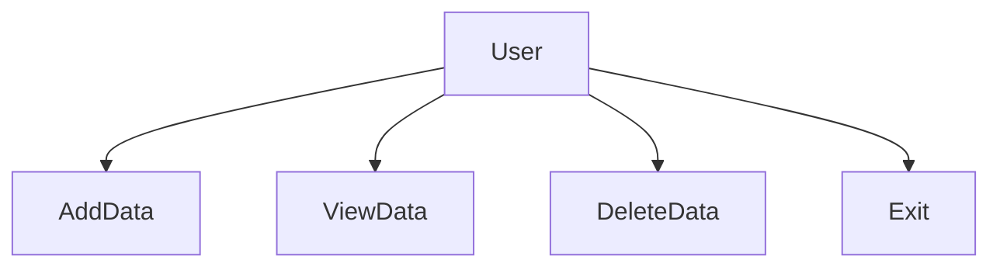
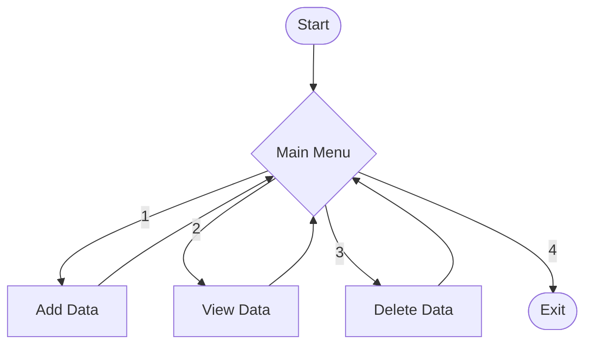

# unknownapp

This is an unknown application written in Java

---- For Submission (you must fill in the information below) ----

## Use Case Diagram

## Flowchart of the main workflow

## Prompts

- Convert Java menu-based program to Python
- Create simple list-based data storage in Python
- Implement add and view functionality
